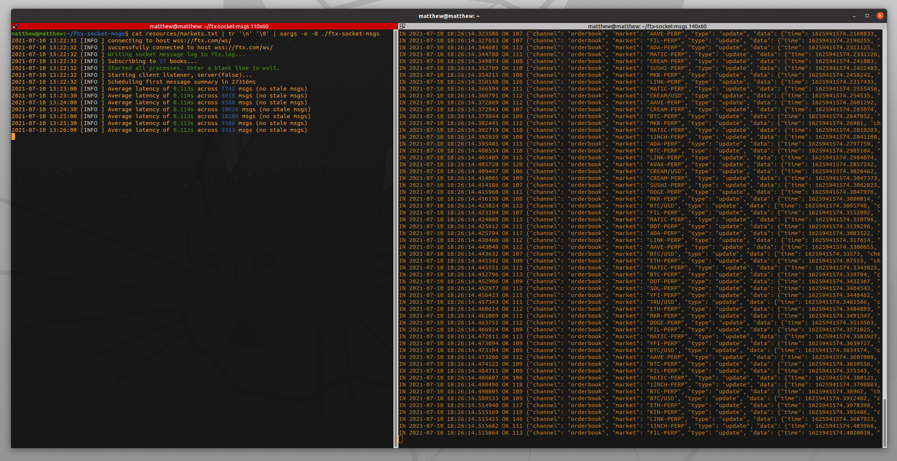

# ftx-socket-msgs

A lightweight client for the [FTX WebSocket API](https://docs.ftx.com/#websocket-api) 
which keeps an eye on the difference between the timestamp reported in the message and
the local system time, keeping a log of messages and timestamps.

Written in [V](https://github.com/vlang/v) because, why not? Very fast and compiles to a compact 
1.9M binary.

### Build

Install the V compiler:
```
git clone https://github.com/vlang/v
cd v
make
sudo ./v symlink
```

Then clone this repository and build the source file:
```
git clone https://github.com/matthewdowney/ftx-socket-msgs
cd ftx-socket-msgs
v ftx.v -o ftx-socket-msgs
```

### Use 

Specify which order book channels to connect to by passing any number of markets as arguments:

```
./ftx-socket-msgs BTC/USD ETH/USD TSLA/USD
2021-07-10 13:41:27 [INFO ] connecting to host wss://ftx.com/ws/
2021-07-10 13:41:28 [INFO ] successfully connected to host wss://ftx.com/ws/
2021-07-10 13:41:28 [INFO ] Writing socket message log to ftx.log...
2021-07-10 13:41:28 [INFO ] Subscribing to 3 books...
2021-07-10 13:41:28 [INFO ] Started all processes. Enter a blank line to exit.
2021-07-10 13:41:28 [INFO ] Starting client listener, server(false)...
2021-07-10 13:41:28 [INFO ] Scheduling first message summary in 1844ms
2021-07-10 13:41:30 [INFO ] Average latency of 0.163s across 37 msgs (no stale msgs)
2021-07-10 13:42:00 [INFO ] Average latency of 0.166s across 894 msgs (no stale msgs)
```

The connection opens and you get a summary of message number and latency every 30 seconds, with 
detailed info for each message written to ftx.log.

Alternatively, to connect to many markets, it's be convenient to list them out in a file and use
`xargs` to pass them as arguments. Just don't forget the `-o` option which gives control of 
stdin back to the ftx-socket-msgs process.

```
cat resources/markets.txt | tr '\n' '\0' | xargs -o -0 ./ftx-socket-msgs
```



Console output on the left, a running tail of the ftx.log file on the right.
